# ARIA Airline Chatbot — Botpress AI Customer Support System

## Overview

ARIA is a Botpress-based AI airline customer support chatbot created as a cleaned portfolio version of an Introduction to Artificial Intelligence academic group project.

ARIA supports:

- customer intake
- main menu routing
- flight status checking
- booking management
- baggage support
- travel policy assistance
- human-agent escalation
- knowledge base integration
- structured data tables
- website/webchat integration

## My Contribution

My contribution focused on the chatbot design, semantic knowledge representation, Botpress knowledge base organization, workflow documentation, and portfolio presentation. I helped document how ARIA uses semantic networks, structured knowledge base files, Botpress tables, AI transitions, and workflow branches to support airline customer service interactions.

## Project Features

- Botpress chatbot implementation
- AI-assisted main menu routing
- menu-first conversation design
- semantic-network-based knowledge representation
- knowledge base documents
- structured Botpress tables
- flight status lookup
- booking management flow
- baggage support flow
- travel policies autonomous/KB-based support
- escalation to human support
- website/webchat integration

## Technologies Used

- Botpress
- Artificial Intelligence
- Conversational AI
- Knowledge Base
- Semantic Networks
- CSV Tables
- Chatbot Workflow Design
- Webchat Integration
- Draw.io
- Low-code / no-code development

## Project Structure

```text
aria-airline-chatbot-botpress/
├── README.md
├── .gitignore
├── botpress-export/
│   └── aria-airline-chatbot.bpz
├── knowledge-base/
│   ├── overview.txt
│   ├── core-knowledge-model.txt
│   ├── passenger-contact-and-travel-documents.txt
│   ├── booking-payment-and-refund-support.txt
│   ├── ticket-and-baggage-support.txt
│   ├── flight-airport-aircraft-terminal-and-gate.txt
│   ├── conversation-policy-and-validation-rules.txt
│   ├── escalation-policy.txt
│   ├── semantic-relationships-representation.txt
│   ├── qa-retrieval-chunks.txt
│   └── travel-policies-and-passenger-compliance-rules.txt
├── data/
│   ├── bookings-table.csv
│   ├── customers-table.csv
│   └── flight-status-table.csv
├── diagrams/
│   ├── main-semantic-relationship-diagram.png
│   ├── passenger-semantic-relationship-diagram.png
│   ├── flight-semantic-relationship-diagram.png
│   ├── payment-and-booking-semantic-relationship-diagram.png
│   ├── ticket-and-baggage-semantic-relationship-diagram.png
│   ├── customer-details-and-main-menu-flowchart.png
│   ├── flight-status-menu-flowchart.png
│   ├── booking-management-menu-flowchart.png
│   ├── baggage-service-menu-flowchart.png
│   └── other-help-menu-flowchart.png
├── screenshots/
│   ├── customer-details-and-main-menu-screenshot-1.png
│   ├── customer-details-and-main-menu-screenshot-2.png
│   ├── flight-status-menu-screenshot.png
│   ├── booking-management-menu-screenshot.png
│   ├── baggage-service-menu-1.png
│   ├── baggage-service-menu-2.png
│   ├── baggage-service-menu-3.png
│   ├── travel-policies-menu-screenshot.png
│   ├── other-help-menu-screenshot.png
│   └── website-screenshot.png
└── documentation/
    └── aria-chatbot-documentation.pdf
```

## Botpress Export

`botpress-export/aria-airline-chatbot.bpz` contains the exported Botpress chatbot project. It can be imported into Botpress Studio for review or reuse.

## Knowledge Base Files

| File | Purpose |
|---|---|
| `overview.txt` | Defines the chatbot scope and main service areas. |
| `core-knowledge-model.txt` | Defines major airline entities and relationships. |
| `passenger-contact-and-travel-documents.txt` | Covers passenger identity, contact, and travel document support. |
| `booking-payment-and-refund-support.txt` | Supports booking, payment, refund, cancellation, and modification queries. |
| `ticket-and-baggage-support.txt` | Supports ticket, seat, and baggage-related responses. |
| `flight-airport-aircraft-terminal-and-gate.txt` | Supports flight status, airport, terminal, gate, and aircraft information. |
| `conversation-policy-and-validation-rules.txt` | Defines validation, clarification, and safe conversation rules. |
| `escalation-policy.txt` | Defines when the chatbot should escalate to human support. |
| `semantic-relationships-representation.txt` | Represents airline concepts as semantic network relationships. |
| `qa-retrieval-chunks.txt` | Provides retrieval-oriented Q&A patterns. |
| `travel-policies-and-passenger-compliance-rules.txt` | Provides travel policy and passenger compliance rules. |

## Data Tables

| File | Purpose |
|---|---|
| `bookings-table.csv` | Sample booking records used for booking validation and management. |
| `customers-table.csv` | Sample customer records used for customer intake and identification. |
| `flight-status-table.csv` | Sample flight status records used for flight lookup and operational responses. |

## Diagrams

### Main Semantic Relationship Diagram

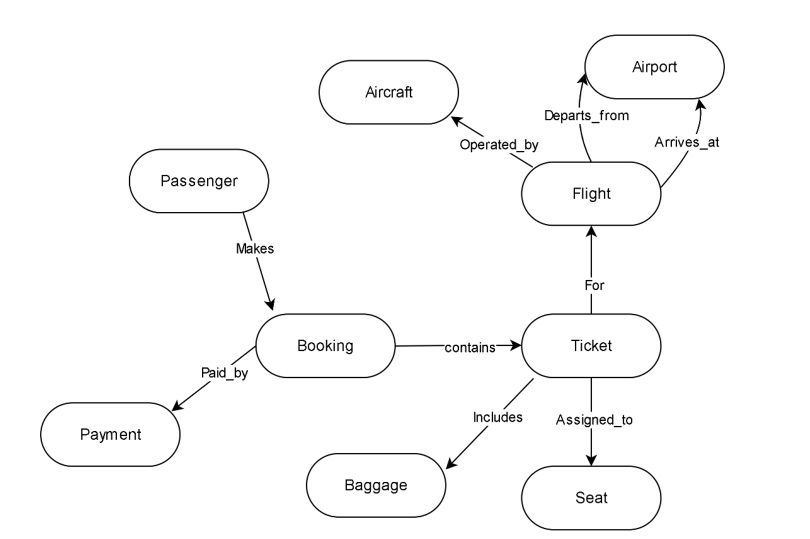

### Passenger Semantic Relationship Diagram

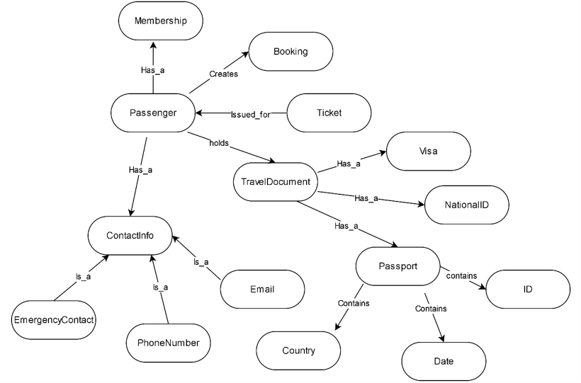

### Flight Semantic Relationship Diagram

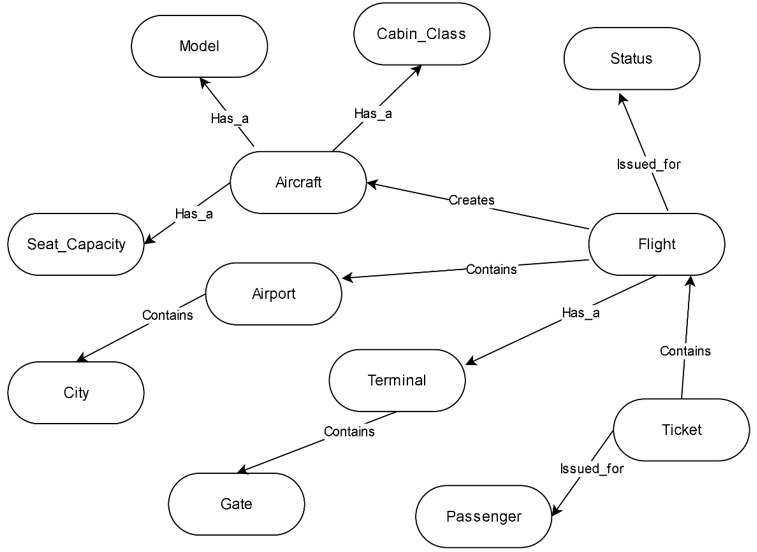

### Payment and Booking Semantic Relationship Diagram

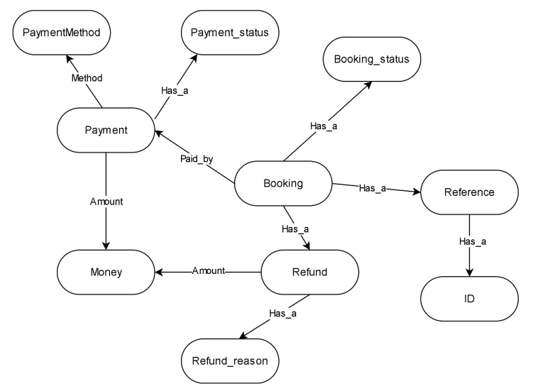

### Ticket and Baggage Semantic Relationship Diagram

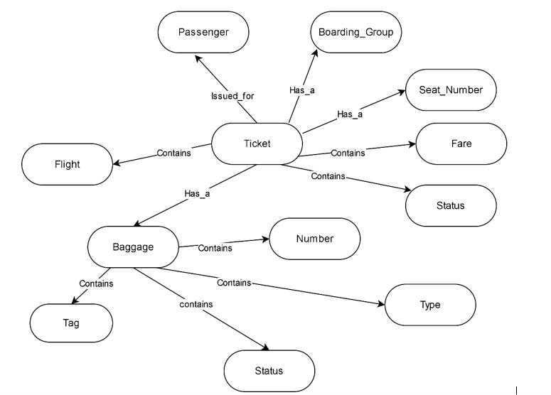

### Customer Details Collection and Main Menu Flowchart

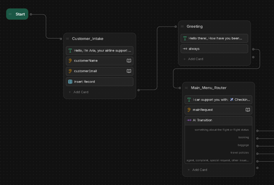

### Flight Status Menu Flowchart

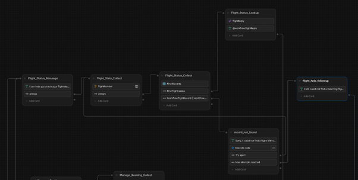

### Booking Management Menu Flowchart

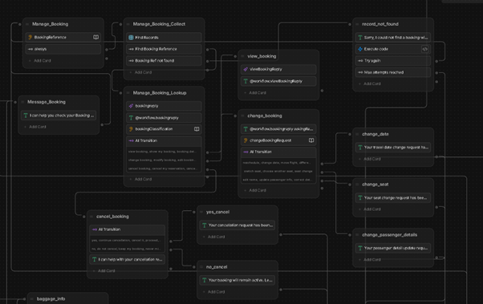

### Baggage Service Menu Flowchart

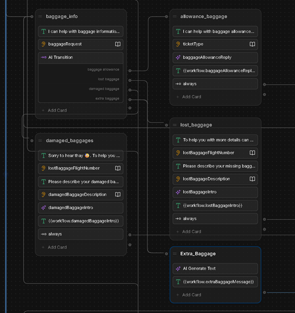

### Other Help Menu Flowchart

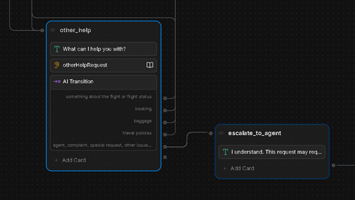

## Screenshots

### Customer Details Collection and Main Menu

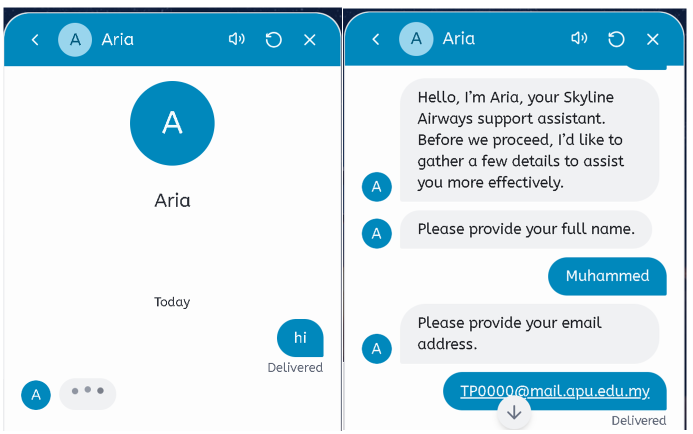

### Customer Details Collection and Main Menu — Second View

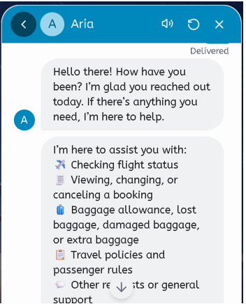

### Flight Status Menu

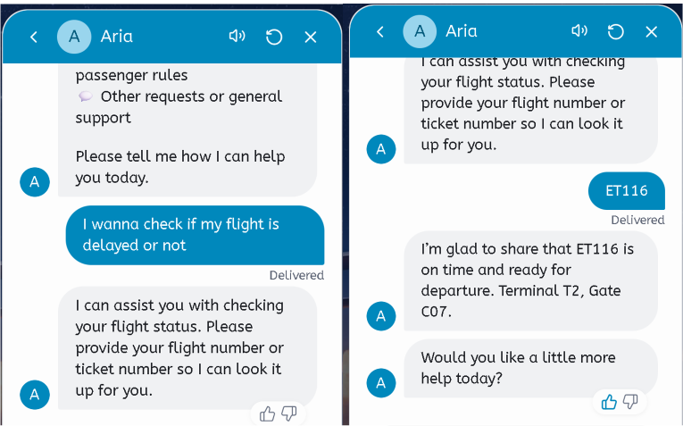

### Booking Management Menu

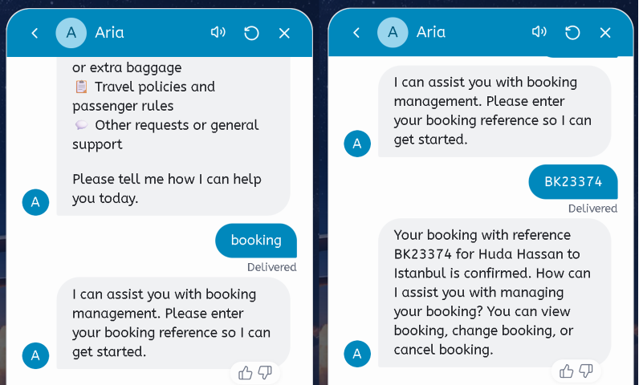

### Baggage Service Menu 1

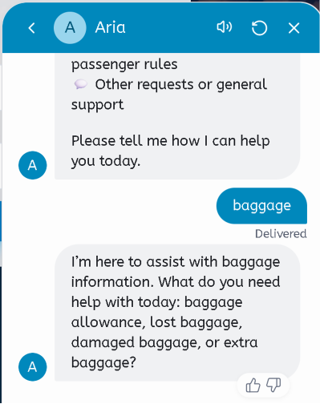

### Baggage Service Menu 2

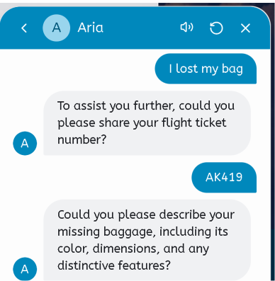

### Baggage Service Menu 3

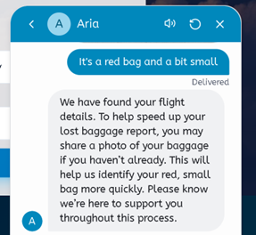

### Travel Policies Menu

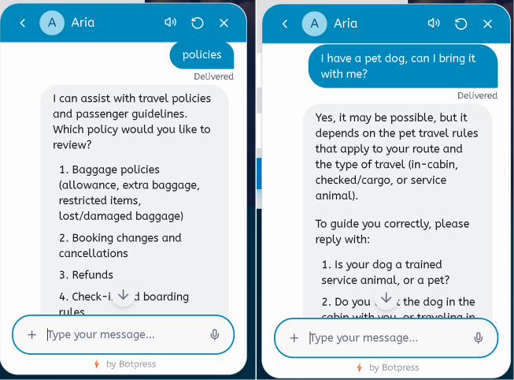

### Other Help Menu

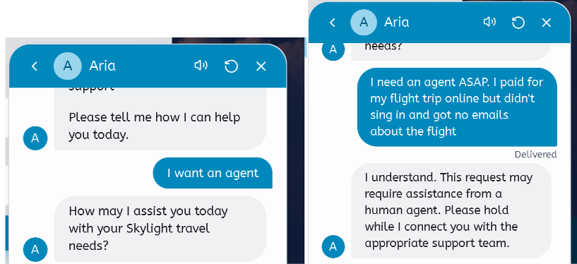

### Website Integration

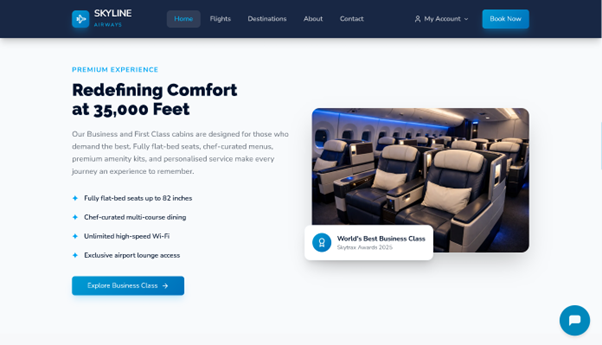

## Documentation

[ARIA Chatbot Documentation](documentation/aria-chatbot-documentation.pdf)

## What I Learned

- chatbot workflow design
- Botpress implementation
- AI-assisted routing
- semantic knowledge representation
- knowledge base design
- data table integration
- conversation validation
- user-centered chatbot design
- website/webchat presentation

## Future Improvements

- connect to real airline APIs
- improve real-time flight status retrieval
- add more natural language understanding
- add multilingual support
- add analytics dashboard
- add stronger authentication before booking changes
- improve human-agent escalation integration

## Privacy Notes

This repository is a cleaned portfolio version of an academic group project. Private academic details, private Botpress workspace links, API keys, tokens, lecturer names, student IDs, and raw submission details are intentionally excluded.
